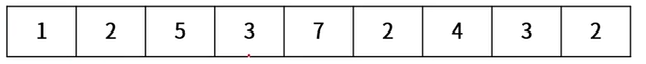
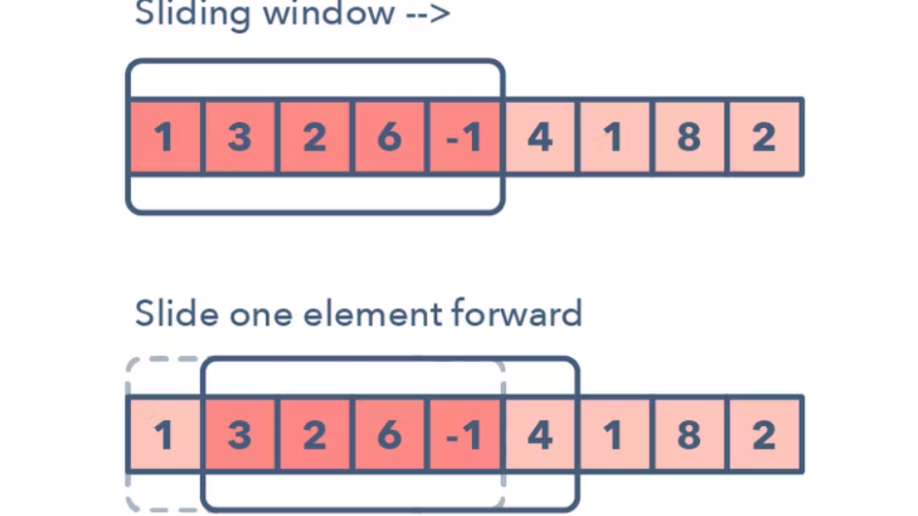

# 투 포인터, 슬라이딩 윈도우, 이진 탐색

**Description:** 이론 설명이 짧아서 문제로 넣어왔습니다. 안 겹치게 백준말고 다른데서 가져왔습니다. 혹시 시간되시면(?) 풀어봐도 좋습니다.

## 투 포인터


- 배열에서 두 개의 포인터를 사용해서 두 개의 점의 위치를 기록하면서 처리하는 알고리즘
- 두 개의 포인터를 배치하는 방법
    - 같은 방향에서 시작 : 첫 번째 원소에 둘 다 배치
    - 서로 다른 방향에서 시작 : 첫 번째 원소와 마지막 원소에 배치
- 시간 초과가 나는 완전 탐색의 대안 : 주로 다중 for문(완전 탐색)의 복잡도를 선형적으로 풀어나가는데에 쓰인다.
- 구현
    - left, right 나 start, end 같은 식으로 2개의 포인트 변수를 사용한다.
    - 찾는 값을 target이든 변수로 저장한다.
    - while문으로 돌리되, 조건은 start<=end, 두 개 다 배열 범위내에서 이동해야 한다. 

### 대표 예제

특정 합을 갖는 부분 연속 수열 찾기
- case1 : 같은 방향에서 시작
    
    예시) 아래의 배열에서 합이 9가 되는 구간들의 배열

  
    <br>
    
    - 완전탐색 시간 복잡도 : O(N^2)
        
        1부터 각 원소를 하나씩 다 비교해서 합이 9가되는지 확인한다.
        
        ```java
        int[] arr = {1, 2, 5, 3, 7, 2, 4, 3, 2};
        int target = 9;
        
        public static ArrayList<int[]> forLoop(int[] arr, int target) {
            ArrayList<int[]> result = new ArrayList<>();
    
            int subSum = 0;
    
            for(int i = 0; i < arr.length; i++){
                subSum = arr[i];
                for(int j = i + 1; j < arr.length; j++){
                    subSum += arr[j];
                    if(subSum == target){
                        result.add(new int[]{i, j - 1});
                        break;
                    }
                }
            }
            
            return result;
        }

        ```
        
    - 투 포인터 시간 복잡도 : 대략 O(N)
        
        첫 번째, 두 번째 포인터를 맨 앞에 배치, 부분 배열의 합이 9를 넘기지 않을 때까지 두 번째 포인터 증가, 부분 배열의 합이 9초과 시 첫 번째 포인터 증가
        
        ```java
        public static ArrayList<int[]> twoPointers(int[] arr, int target) {
            int p1 = 0;
            int p2 = 0;
            int subSum = 0;
            ArrayList<int[]> result = new ArrayList<>();
    
            while(true) {
                if(subSum > target){
                    subSum -= arr[p1++];
                } else if(p2 == arr.length){
                    break;
                } else {
                    subSum += arr[p2++];
                }
    
                if(subSum == target) {
                    result.add(new int[]{p1, p2 - 1});
                }
            }
            return result;
        }
        ```
        


- case2 : 반대 방향에서 오는 경우


문제 예시1 ) a, b, c, d 로 이루어진 알파벳 문자열에 대해서

다음과 같은 규칙으로 문자열을 정리한 후 남은 문자열을 반환하는 프로그램을 작성하세요.

양쪽의 문자를 비교한 후 같으면 삭제하는데, 연속해서 같은 문자가 등장하면 함께 삭제한다. 최종적으로 남은 문자열을 반환하세요.

입출력 예시

입력 s: "ab"

출력: "ab"

입력 s: "aaabbaa"

출력: (없음)

```java
public static String solution(String s) {

    int p1 = 0;
    int p2 = s.length() - 1;

    while (p1 <= p2 && s.charAt(p1) == s.charAt(p2)){
        char c = s.charAt(p2);

        while (p1 <= p2 && s.charAt(p1) == c){
            p1++;
        }

        while (p1 <= p2 && s.charAt(p2) == c){
            p2--;
        }
    }

    return s.substring(p1, p2 + 1);
}
```

- 문제 예시 2) 구명 보트

무인도에 갇힌 사람들을 구명보트를 이용하여 구출하려고 합니다. 구명보트는 작아서 한 번에 최대 **2명**씩 밖에 탈 수 없고, 무게 제한도 있습니다.

예를 들어, 사람들의 몸무게가 [70kg, 50kg, 80kg, 50kg]이고 구명보트의 무게 제한이 100kg이라면 2번째 사람과 4번째 사람은 같이 탈 수 있지만 1번째 사람과 3번째 사람의 무게의 합은 150kg이므로 구명보트의 무게 제한을 초과하여 같이 탈 수 없습니다.

구명보트를 최대한 적게 사용하여 모든 사람을 구출하려고 합니다.

사람들의 몸무게를 담은 배열 people과 구명보트의 무게 제한 limit가 매개변수로 주어질 때, 모든 사람을 구출하기 위해 필요한 구명보트 개수의 최솟값을 return 하도록 solution 함수를 작성해주세요.

### 제한사항

- 무인도에 갇힌 사람은 1명 이상 50,000명 이하입니다.
- 각 사람의 몸무게는 40kg 이상 240kg 이하입니다.
- 구명보트의 무게 제한은 40kg 이상 240kg 이하입니다.
- 구명보트의 무게 제한은 항상 사람들의 몸무게 중 최댓값보다 크게 주어지므로 사람들을 구출할 수 없는 경우는 없습니다.

```java
import java.util.*;

class Solution {
    public int solution(int[] people, int limit) {
        int answer = 0;
        
        Arrays.sort(people);
        
        int start = 0;
        int end = people.length-1;
        
        while(start <= end){
            // 2명탑승
            if(people[start] + people[end] <= limit){
                start++;
                end--;
                answer++;
            // 가장 무거운사람 한명 탑승
            }else{
                end--;
                answer++;
            }
        }
        return answer;
    }
}
```

- 그 외 예제

    *  [**에라토스테네스의 체 +** 투 포인터 알고리즘](https://www.acmicpc.net/problem/1644)


## 슬라이딩 윈도우


- 2개의 포인터로 범위를 지정한 다음 범위를 유지한 채로 이동하며 문제를 해결하는 방법
- 투 포인터와의 차이점
    - 슬라이딩 윈도우는 어느 순간에도 그 구간의 넓이가 동일하다.
- 예제
    
    N개의 카드가 일렬로 놓여져 있다. 각 카드에는 숫자가 적혀있다. 현수는 카드가 일렬로 놓여진 줄의 양 끝 왼쪽 맨 끝카드와 오른쪽 맨 끝 카드 둘 중 하나를 가져갈 수 있다. 그리고 가져간 카드에 적혀진 숫자의 총합이 현수가 얻는 점수이다. 일렬로 놓여진 각 카드의 숫자가 매개변수 nums에 주어지고, 현수가 가져갈 수 있는 카드의 개수 k가 주어지면 현수가 얻을 수 있는 최대 점수를 반환해라. 

    

- 아이디어 : 가져가는 카드에만 집중하지 않는다.!
    
```java
public int solution(int[] nums, int k) {
    int answer = Arrays.stream(nums).reduce(0, (a, b) -> a + b);
    int m = nums.length - k; // 남아있는 카드의 개수
    int sum = 0 ;
    for(int i = 0; i < m; i++) sum += nums[i];
    int mins = sum;
    for(int i = m; i < nums.length; i++){
        sum += (nums[i] - nums[i - m]); // 슬라이딩 윈도우
        mins = Math.min(mins, sum);
    }
    return answer - mins;
}
```

    
- DP 대신 슬라이딩 윈도우로

[https://www.acmicpc.net/problem/2096](https://www.acmicpc.net/problem/2096)

[https://www.acmicpc.net/problem/1806](https://www.acmicpc.net/problem/1806)

예제 백준 2018번

백준 1940

백준 1253

백준 12891

백준 11003

## 이진 탐색

<br><br>

특징

- **정렬된 상태**의 데이터에서 특정 값을 빠르게 탐색하는 방법
    - 찾고자 하는 값과 데이터 **중앙**에 있는 값을 비교한다.
        - 찾고자 하는 값이 더 작으면 데이터 왼쪽 부분에서 이진 탐색을 진행한다.
        - 찾고자 하는 값이 더 크면 데이터 오른쪽 부분에서 이진 탐색을 진행한다.
- **시간 복잡도 : O(logn)**
- 구현 방법
    1. 배열의 중간 값을 가져옵니다.
    2. 중간 값과 검색 값을 비교합니다.
        1. 중간 값이 검색 값과 같다면 종료합니다. (mid = key)
        2. 중간 값보다 검색 값이 크다면 중간값 기준 배열의 오른쪽 구간을 대상으로 탐색합니다. (mid < key)
        3. 중간 값보다 검색 값이 작다면 중간값 기준 배열의 왼쪽 구간을 대상으로 탐색합니다. (mid > key)
    3. 값을 찾거나 간격이 비어있을 때까지 반복합니다.

### 구현 방법 (1) - 반복문 구조

```sql
public static int binarySearch(int arr[], int target) {
    int left = 0;
    int right = arr.length - 1;

    while (left <= right) {
        int mid = left+ (right - left) / 2;

        if(target == arr[mid]) {
            return mid;
        } else if (target < arr[mid]) {
            right = mid - 1;
        } else {
            left = mid + 1;
        }
    }
    
    return -1;
}
```

### 구현 방법 (2) - 재귀 호출 구조

```sql
public static int binarySearch2(int[] arr, int target, int left, int right) {
    if(left > right) {  // 재귀 탈출 조건
        return -1;
    }

    int mid = left+ (right - left) / 2;   // 가운데 인덱스 지정

    if(target == arr[mid]) {    // 탐색 조건 if else문 진입
        return mid;
    } else if (target < arr[mid]) {
        return binarySearch2(arr, target, 0, mid - 1);
    } else {
        return binarySearch2(arr, target, mid + 1, right);
    }
}
```

### 사용 방법 (3) - 자바 라이브러리 활용

```sql
int[] arr = {1, 2, 5, 10, 20, 30, 40, 50 , 60};

int idx1 = Arrays.binarySearch(arr, 1); // 데이터 있는 경우, 0
// 해당 데이터가 있는 위치의 인덱스를 반환해줌

int idx2 = Arrays.binarySearch(arr, 11); // -5
// 해당 데이터가 배열 안에 있다면, 들어갈 인덱스 위치를 마이너스 부호로 변환, 
// 거디다 1을 다시 뺀 값 
```

- 데이터가 없는 경우 반환된 값을 통해 삽입 위치를 알 수 있다.
    - 1을 더하고 부호를 뒤집으면 된다.

### 관련 예제

- (슬라이딩 윈도우 / 이진 탐색)
- https://school.programmers.co.kr/learn/courses/30/lessons/43236
- https://school.programmers.co.kr/learn/courses/30/lessons/43238

문제 1) 📌📌📌
정수형 배열 weights 와 정수 days 가 주어졌다.
weights 에는 각 상품의 무게들의 정보가 들어있고, days 는 운송 납기일이다.
상품들은 weights 에 적혀있는 순서대로 실어서 운송해야 하는데,
days 이내에 운송을 하기 위한 차량의 최소한의 적재량을 계산하는 프로그램을 작성하세요.

// 입출력 예시
// weights: 1, 2, 3, 4, 5, 6, 7, 8, 9, 10
// days: 5
// 출력: 15

// weights: 3, 2, 2, 4, 1, 4
// days: 3
// 출력: 6

**아이디어** : 최소한의 적재량 ( weights 중 가장 큰 값) ~ 최대 적재량( weights 배열의 모든 값의 합) 까지의 숫자의 범위가 다 **정렬되어 있다**는 것에서 착안

- 적재량을 이분 탐색으로 해서, 최대의 요일을 다 소요하면서 함유할 수 있는 최소 적재량을 구할 수 있다.

```sql
public class Practice4 {
    public static int solution(int[] weights, int days) {
        int left = 0;
        int right = 0;

        for(int w : weights) {
            left = Math.max(left, w);
            right += w;
        }

        while (left <= right) {
            int mid = left + (right - left) / 2;
            int cnt = 1;
            int cur = 0;

            // 적정 적재량 (가설) mid 까지 나눠서 몇 개로 분류되는지 개수를 센다.
            for(int w :weights) {
                if(cur + w > mid) {
                    cnt++;
                    cur = 0;
                }
                cur += w;
            }

            if(cnt > days) {
                left = mid + 1;
            } else {
                right = mid - 1;
            }
        }
        return left;
    }

    public static void main(String[] args) {
        // Test code
        int[] weights = {1, 2, 3, 4, 5, 6, 7, 8, 9, 10};
        System.out.println(solution(weights, 5));   // 15

        weights = new int[]{3, 2, 2, 4, 1, 4};
        System.out.println(solution(weights, 3));   // 6
    }
}

```

문제 2) 📌📌📌

정수형 배열 nums 와 정수 m 이 주어졌다.
nums 에는 양의 정수 값들이 들어 있고, m 은 배열을 부분 배열로 분리할 수 있는 수이다.
nums 배열을 m 개의 부분 배열로 분리할 때,
각 부분 배열의 합중 가장 큰 값이 최소가 되도록 분리했을 때의 합을 출력하세요.

// 입출력 예시
// nums: 7, 2, 5, 10, 8
// m: 2
// 출력: 18

// nums: 1, 2, 3, 4, 5
// m: 2
// 출력: 9

**아이디어** : 최소한의 적재량 ( nums중 가장 큰 값) ~ 최대 적재량( nums배열의 모든 값의 합) 까지의 숫자의 범위가 다 **정렬되어 있다**는 것에서 착안

- 적재량을 이분 탐색으로 해서, 최대의 분할 배열 수를 다 소요하면서 함유할 수 있는 최소 적재량을 구할 수 있다.

```sql
public class Practice5 {
    public static int solution(int[] nums, int m) {
        int left = 0;
        int right = 0;

        for(int num : nums) {
            left = Math.max(left, num);
            right += num;
        }

        if(m == 1) {
            return right;
        }

        while (left <= right) {
            int mid = left + (right - left) / 2;
            int cnt = 1; // 배열이 몇개로 분리되는지 세기 위한 용도
            int total = 0; //분리 되었을 때 부분 배열의 최솟값

            for (int num : nums) {
                total += num;
                if(total > mid) { // mid 초과, 이전까지의 데이터만 하나의 배열
                    total = num;
                    cnt++;
                }
            }

            if(cnt <= m) { // 더 쪼갤 수 있음, 더 작게 제한을 낮춰서 가져갈 수 있음
                right = mid - 1;
            } else {
                left = mid + 1;
            }
        }
        return left;
    }

    public static void main(String[] args) {
        // Test code
        int[] nums = {7, 2, 5, 10, 8};
        System.out.println(solution(nums, 2));  // 18

        nums = new int[] {1, 2, 3, 4, 5};
        System.out.println(solution(nums, 2));  // 9

        nums = new int[] {1, 4, 4};
        System.out.println(solution(nums, 3));  // 4
    }
}

```
